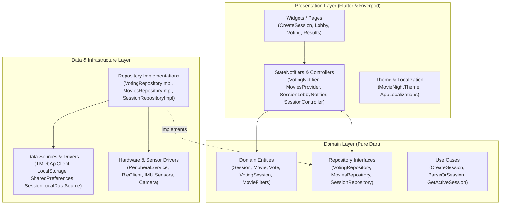
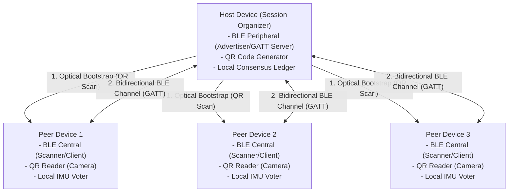
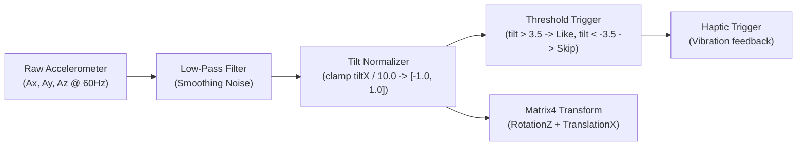
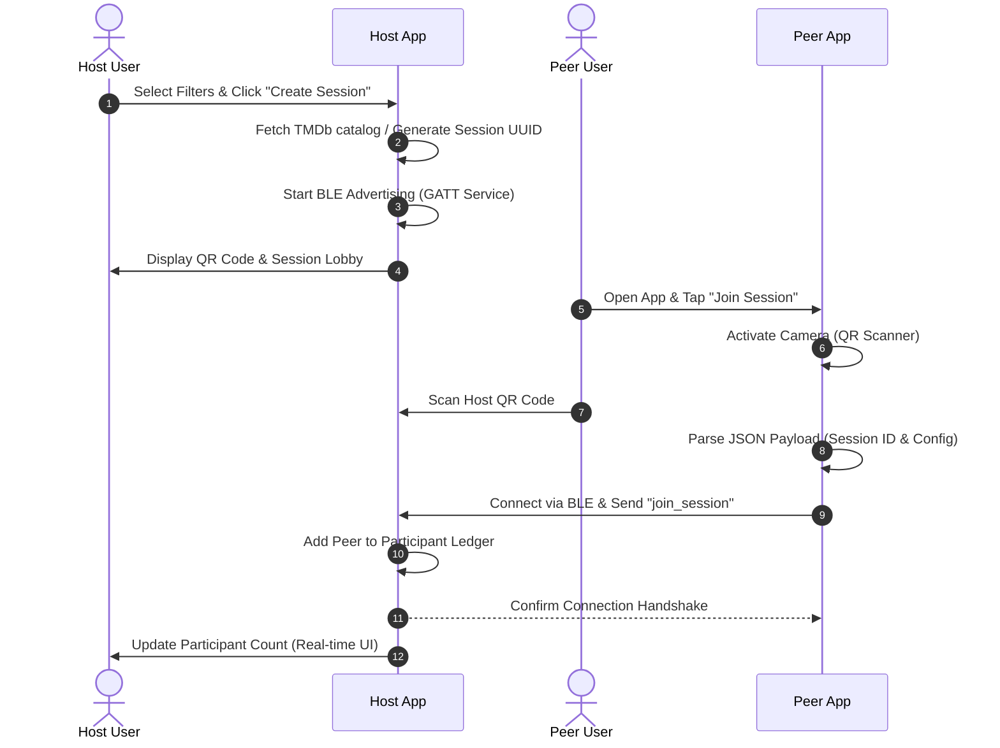
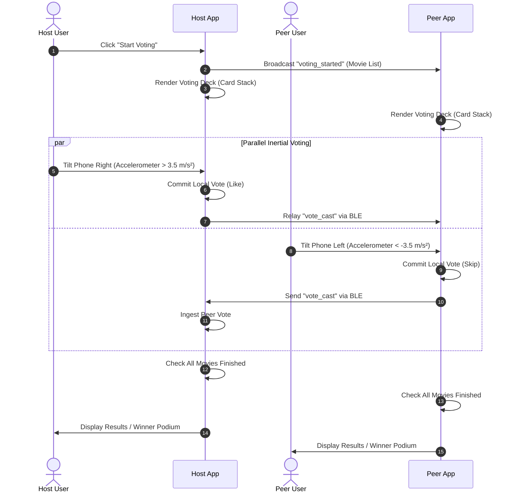

# Architectural Design Document — MovieNight

**Course:** Computação Móvel (CM)  
**Team Identifier:** G02  
**Team Members:**
- 109222 – Gustavo Gião – gustavogiao@ua.pt
- 118313 – Solomiia Koba – solomiia.koba@ua.pt

---

## 1. Executive Summary & Design Principles

MovieNight is designed around the principle of **Decoupled Edge Computing**. Unlike typical collaborative mobile applications that rely on real-time web backends (such as Firebase Realtime Database or AWS WebSocket gateways), MovieNight operates completely **backend-free**. 

The design is governed by four core architectural principles:
1. **Zero-Backend Dependency:** All consensus logic, vote aggregation, and session states are executed directly on the participant mobile devices.
2. **Offline-First Resilience:** Movie catalogs, session states, and user preferences are persisted in local flash storage, permitting sessions to continue seamlessly through internet outages.
3. **Clean Architecture Separation:** The codebase strictly segregates user interface concerns, domain business rules, and hardware/network drivers into decoupled layers.
4. **Physicality-Driven Interaction:** Device sensors (Inertial Measurement Units, Cameras, Bluetooth chipsets) are first-class input drivers, transforming passive screen tapping into a shared physical social ritual.

---

## 2. Layered Architecture (Clean Architecture)

The system follows a three-tier Clean Architecture model implemented in Flutter and Dart:



### 2.1 Presentation Layer
- **Components:** Stateful and stateless widgets, particle field renderers, custom canvas painters, and responsive layouts. Pages follow a declarative composition model where screen files orchestrate reusable feature widgets (e.g., headers, state views, filter sections, modals, and action buttons).
- **State Management:** Utilizes **Flutter Riverpod** (`StateNotifierProvider`, `ConsumerWidget`). State models are strictly immutable. UI components never access storage or sensors directly; they react to reactive state streams.
- **Design System:** Features a dual-palette architecture (`MovieNightTheme.light` and `MovieNightTheme.dark`) driven by Material 3 `ColorScheme` contracts, avoiding hardcoded hex colors and allowing instantaneous theme transitions.

### 2.2 Domain Layer
- **Pure Business Logic:** Contains zero dependencies on Flutter rendering engines or platform libraries.
- **Entities (`domain/entities/`):**
  - `Movie`: Models cinematic metadata (TMDb identifier, title, release date, runtime, rating, genres, poster path, streaming providers).
  - `MovieFilters`: Value object specifying genre subsets, year brackets, rating thresholds, and runtime constraints.
  - `Genre`: Models localized genre representation (ID, PT name, EN name).
  - `AppSettings`: Models application-wide configuration (ThemeMode, Locale).
  - `Vote`: Models individual participant vote on a candidate movie.
  - `VotingSession`: Aggregate root computing movie ranking and like tallies.
  - `ArTrophyConfig`: Models 3D holographic AR trophy presentation and statistics.
  - `HomeQuickAction`: Models primary navigation actions on the landing view.
- **Exceptions (`domain/exceptions/`):**
  - `MovieException`, `TmdbApiException`, `TmdbApiKeyException`, `MovieNetworkException`.
  - `SessionException`, `SessionNotFoundException`, `InvalidSessionPayloadException`, `SessionConnectionException`.
  - `VotingException`, `VotingSessionNotFoundException`, `VotingStorageException`.
- **Repository Contracts (`domain/repositories/`):**
  - `MovieRepository`: Abstract contract defining movie retrieval, caching, and streaming provider lookups.
  - `SessionRepository`: Abstract contract defining session persistence and discovery.
  - `SettingsRepository`: Abstract contract defining configuration retrieval and preferences storage.
  - `VotingRepository`: Abstract contract defining voting session persistence and vote registration.
  - `HomeRepository`: Abstract contract defining quick actions retrieval.
  - `ArCapabilityService`: Abstract service contract defining device camera and AR availability verification.
- **Use Cases (`domain/usecases/`):**
  - `CreateSessionUseCase`, `GetActiveSessionUseCase`, `ParseQrSessionUseCase`.
  - `GetSettingsUseCase`, `UpdateThemeUseCase`, `UpdateLocaleUseCase`.
  - `SaveVotingSessionUseCase`, `GetVotingSessionUseCase`, `CastVoteUseCase`, `ClearVotingSessionUseCase`.
  - `GetArTrophyConfigUseCase`.
  - `GetHomeActionsUseCase`.

### 2.3 Data Layer
- **Data Sources (`data/datasources/`):**
  - `TmdbApiClient`: Pure HTTP client querying `/discover/movie`, `/movie/{id}/watch/providers`, and `/genre/movie/list`.
  - `TmdbGenreCatalog`: Constant catalog of the 19 official TMDb genres and PT streaming provider lookup tables.
  - `MovieLocalDataSource`: Session-scoped and persistent global cache using `SharedPreferences`.
  - `MockMovieDataSource`: Offline dataset used for zero-network fallback and air-gapped guarantees.
  - `SessionLocalDataSource`: Active session state cache stored in `SharedPreferences`.
  - `SettingsLocalDataSource`: Application preferences persistence layer backing theme and locale keys.
  - `VotingLocalDataSource`: Session voting state and ledger cache in `SharedPreferences`.
  - `HomeLocalDataSource`: Navigation entries catalog.
- **Data Models / DTOs (`data/models/`):**
  - `TmdbMovieDto`: Deserializes raw TMDb JSON responses and converts them into the clean domain `Movie` entity via `toDomain()`.
  - `TmdbGenreModel`: Deserializes TMDb genre API payloads.
  - `SessionDto`: JSON serialization and mapping for session aggregate roots.
  - `SettingsDto`: Deserializes and serializes persisted configuration maps.
  - `VoteDto`: DTO mapping participant vote records.
  - `VotingSessionDto`: DTO mapping multi-participant voting sessions and ranking.
- **Repositories (`data/repositories/`):**
  - `MovieRepositoryImpl`: Clean Architecture repository implementation coordinating TMDb remote fetching, local persistence, and offline fallback.
  - `SessionRepositoryImpl`: Manages active session lifecycle in storage.
  - `SettingsRepositoryImpl`: Implements configuration retrieval and persistence logic.
  - `VotingRepositoryImpl`: Implements voting state lifecycle and vote persistence.
  - `HomeRepositoryImpl`: Provides quick action domain models.

### 2.4 Presentation Layer
- **Pages (`presentation/pages/`):** Modular compositions (`HomePage`, `MoviesListPage`, `MovieFiltersPage`, `CreateSessionPage`, `ScanSessionPage`, `SessionLobbyPage`, `SettingsPage`, `VotingPage`, `ResultsPage`, `ArWinnerPage`).
- **Providers (`presentation/providers/`):** Riverpod state notifiers (`homeActionsProvider`, `moviesProvider`, `movieFiltersProvider`, `sessionLobbyNotifierProvider`, `appSettingsProvider`, `themeProvider`, `localeProvider`, `votingProvider`, `votingProviders`, `arCapabilityServiceProvider`, `arSupportedProvider`).
- **Services (`presentation/services/`):** Hardware sensor and gesture controllers (`TiltSensorService`, `ArSpatialMotionService`).
- **Widgets (`presentation/widgets/`):** Atomic and section-level reusable visual components decoupled from state logic (including AR presentation widgets: `ArCameraViewfinder`, `ArPlaneReticle`, `ArTrophyPedestalCard`, `ArTrophyHudOverlay`).

---

## 3. Communication & Topology Model

### 3.1 Hybrid Ad-Hoc Topology
Because MovieNight operates in the same physical space without a router or internet server, it adopts a **Hybrid Star-Mesh Topology** powered by QR bootstrapping and Bluetooth Low Energy (BLE).



### 3.2 Protocol Lifecycles and Payload Structures

#### Step 1: Session Bootstrapping (QR Broadcast)
The host encodes the session baseline into a JSON string formatted as:
```json
{
  "type": "session_invite",
  "sessionId": "1791137933275",
  "name": "Friday Movie Night",
  "createdAt": "2026-10-04T19:20:00Z",
  "organizerId": "usr-8a9d12",
  "participantIds": []
}
```
Peers scan this QR code, instantly acquiring all parameters without performing a network handshake.

#### Step 2: BLE Proximity & Join Handshake
Simultaneously, the host activates BLE advertising using a custom Service UUID (`00000001-0000-1000-8000-00805F9B34FB`).
Peers discover the host advertising packet, connect, and emit a `join_session` payload:
```json
{
  "type": "join_session",
  "sessionId": "1791137933275",
  "participantId": "usr-4b3f81"
}
```

#### Step 3: Voting Start & Movie Catalog Distribution
When the host finalizes filtering and initiates the vote, the candidate movie catalog is broadcast over BLE:
```json
{
  "type": "voting_started",
  "sessionId": "1791137933275",
  "organizerId": "usr-8a9d12",
  "filters": { "genres": ["Action", "Sci-Fi"], "minRating": 7.5 },
  "movies": [ { "id": 155, "title": "The Dark Knight", ... } ]
}
```

#### Step 4: Real-time Vote Exchange & Idempotent Replay
Each participant casts votes on their own device. As votes occur, they are dispatched to the host:
```json
{
  "type": "vote_cast",
  "sessionId": "1791137933275",
  "vote": {
    "sessionId": "1791137933275",
    "participantId": "usr-4b3f81",
    "movieId": 155,
    "isAffirmative": true,
    "timestamp": "2026-10-04T19:22:15Z"
  }
}
```
The host acts as an ad-hoc relay, rebroadcasting received votes to all connected centrals. If a peer temporarily disconnects, it sends a `request_votes` message upon reconnection, and the host re-transmits the log. The aggregate root treats all votes as idempotent using `(participantId, movieId)` uniqueness.

---

## 4. Hardware & Sensor Pipeline Architecture

### 4.1 Inertial Measurement Unit (IMU) Pipeline
To translate raw physical phone movement into fluid on-screen interactions, MovieNight employs a mathematical filtering pipeline:



1. **Filtering & Clamping:** High-frequency jitter from hand tremors is attenuated via a low-pass filter. The lateral acceleration component ($A_x$) is normalized across a $[-10.0, 10.0]\, \text{m/s}^2$ envelope.
2. **Visual Mapping:** The normalized fraction drives real-time translation ($x = \text{fraction} \times 40.0\,\text{px}$) and rotational roll ($\theta = \text{fraction} \times 0.25\,\text{rad}$), giving the card a tangible physical weight.
3. **Threshold Commitment:** When tilt exceeds $+3.5\,\text{m/s}^2$ for longer than 300 ms, an affirmative vote is committed and haptic feedback fires.

### 4.2 Gyroscopic Roulette Pipeline
For tie-breaking, the gyroscope's Z-axis rotational rate ($\omega_z$) is integrated into angular momentum:
$$\Delta \theta = \omega_z \cdot \Delta t$$
The roulette accelerates proportionally to physical rotational speed, followed by a simulated physics decay (friction coefficient $\mu = 0.985$), settling on the winning movie slice.

### 4.3 Augmented Reality (AR) Surface Anchoring Pipeline
1. **Feature Point Tracking:** The device camera stream is processed via the ARCore/ARKit engine to detect visual contrast points in the room.
2. **Plane Fitting:** Planar regression determines horizontal table/floor surfaces ($y = 0$).
3. **Pose Estimation & Anchoring:** When the user taps the detected plane, a virtual 3D anchor is generated with translation matrix $T$ and rotation quaternion $Q$.
4. **Scene Graph Rendering:** The winning movie poster texture is rendered vertically perpendicular to the anchor plane, with realistic drop shadows and lighting matching the environment illumination estimates.

---

## 5. Sequence Diagrams

### 5.1 Session Bootstrapping & Discovery


### 5.2 Voting Execution & Decentralized Synchronization


---

## 6. Software Architecture Evaluation & Quality Attributes

| Quality Attribute | Architectural Mechanism | Verification Strategy |
|---|---|---|
| **Modularity & Maintainability** | Strict Clean Architecture layer isolation; zero business rules in UI widgets. | Unit testing of domain entities (`VotingSessionTest`, `MovieFiltersTest`). |
| **Offline Fault Tolerance** | TMDb local JSON fallback cache; local state storage via SharedPreferences. | Verified by enabling Airplane Mode after session launch. |
| **Zero Central Cost** | Edge consensus via BLE peripheral mesh; no server instances or database bills. | Verified by full multi-device operation on an isolated, air-gapped network. |
| **Visual Adaptability** | Instantaneous theme switching via `Duration.zero` and strict `ColorScheme` inheritance. | Automated regression testing of theme toggling across light/dark profiles. |
